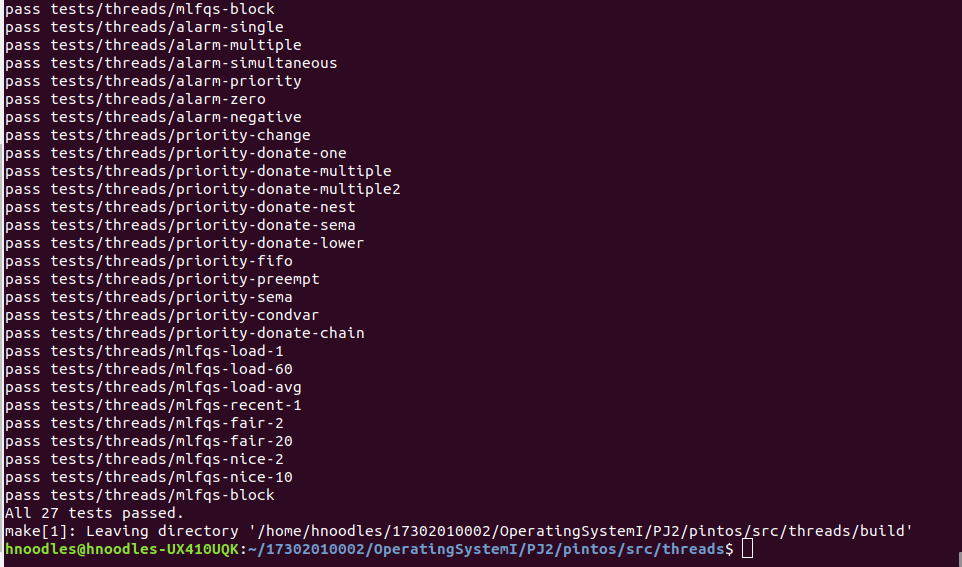
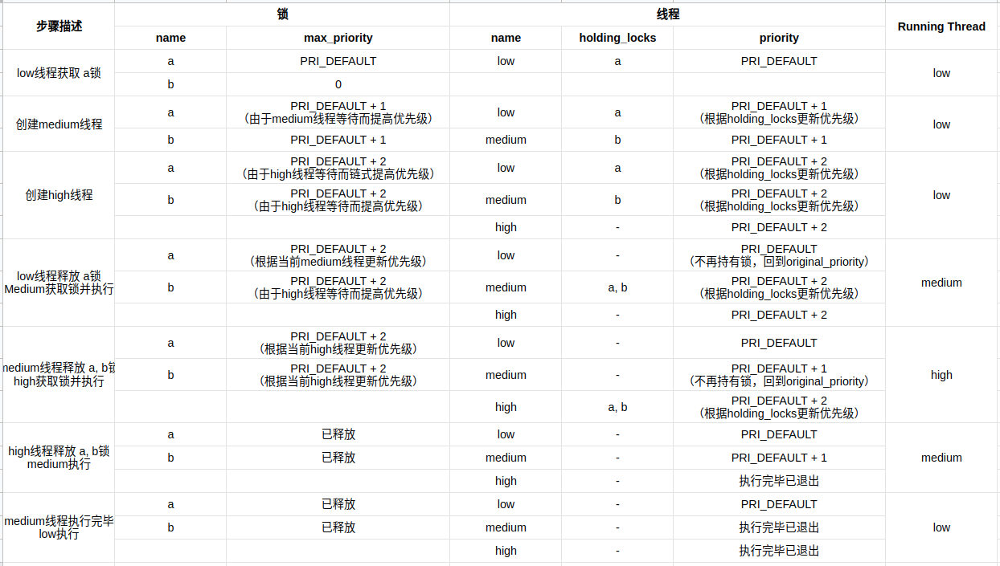
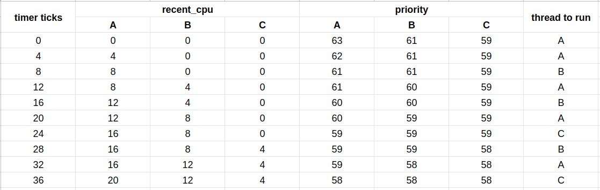

# OS Project Threads Design Document

### 17302010002 黄元敏


## 概述

本文档主要分为测试结果，分阶段实现分析，总结感悟和参考资料几个部分。

其中测试结果部分展示了项目执行测试的结果截图和实现项目之后的代码增量统计；分阶段实现分析部分主要遵循了原本文档中提供的设计文档模板的内容，回答了其中的问题，并加入了一些对实现源码的展示和分析；总结感悟部分写了一些自己完成整个project之后的一些感想和收获；参考资料部分列举了完成project过程中在网上搜索看到的一些比较有帮助的资料。

以下是文档正文。


## 测试结果

执行测试结果截图如下。



剔除不相关文件之后的代码增量如下。

```sh
 pintos/src/devices/timer.c                                |   45 +
 pintos/src/threads/fixed_point.h                          |only
 pintos/src/threads/synch.c                                |  103 +++
 pintos/src/threads/synch.h                                |   12 
 pintos/src/threads/thread.c                               |  270 +++++++++-
 pintos/src/threads/thread.h                               |   29 +
```


## I. ALARM CLOCK

### ---- DATA STRUCTURES ----

>> A1: Copy here the declaration of each new or changed `struct` or `struct` member, global or static variable, `typedef`, or enumeration.  Identify the purpose of each in 25 words or less.

#### 1. struct `thread`

   ```c
   struct thread
     {
	   // ... other members
   
       /* Newly added */
       int64_t ticks_to_sleep;             /* Ticks to sleep until waked up. */
     };
   ```

在`thread`结构体的最后添加了`ticks_to_sleep`成员，标识了该线程需要睡眠多久后被唤醒。


### ---- ALGORITHMS ----

>> A2: Briefly describe what happens in a call to timer_sleep(), including the effects of the timer interrupt handler.

**`void timer_sleep (int64_t ticks)`**

重构前的`timer_sleep`函数是通过busy waiting的方式实现的线程“睡眠”效果，即线程每次被唤醒的时候会通过while循环来确认睡眠时间是否已经过去，如果没有过去，则通过`thread_yield`函数把自己切换出去，并重新`schedule`一个新的`ready_list`中的线程进来run；如果已经过去，则正常执行。这样的实现使得CPU不断切换到一个应该在sleep的线程上来检查睡眠的ticks是否过去，而大部分情况下是没有过去的，导致CPU在睡眠线程和其它线程之间不断切换，耗费资源。

重构后的`timer_sleep`函数在调用后会在当前运行的线程结构体上标记一个`ticks_to_sleep`，该值即传入的需要线程睡眠的`ticks`参数。之后调用`thread_block`函数来阻塞当前线程。race condition保护相关的部分会在SYNCHRONIZATION中提及。

**`static void timer_interrupt (struct intr_frame *args UNUSED)`**

重构后的`timer_interrupt`函数在原先每个`tick`更新`ticks`属性和线程统计信息（以及根据当前线程的执行时间来决定是否强制被强占）的功能之外，还通过调用`thread_foreach`函数实现了对每个`BLOCKED`且`ticks_to_sleep` > 0的线程的该属性自减的更新操作，并对`ticks_to_sleep`减到0的线程（睡眠已结束）进行`thread_unblock`，该函数将会将该线程重新放入`ready_list`中。这些是通过`thread.c`中新增的`thread_ticks_to_sleep_check`函数封装的。

>> A3: What steps are taken to minimize the amount of time spent in the timer interrupt handler?

目前的实现是通过`timer_interrupt`中调用`thread_foreach`实现的，`thread_foreach`中又是通过对`all_list`线程链表做遍历实现的，对一个链表的遍历复杂度是O(n)，应该已经是很优的解法了。

### ---- SYNCHRONIZATION ----

>> A4: How are race conditions avoided when multiple threads call timer_sleep() simultaneously?

多个线程同时调用`timer_sleep`的情况在我的设计中不会产生冲突，因为在`timer_sleep`中仅仅对当前正在执行的线程做了`ticks_to_sleep`的赋值，并不会涉及对公共变量的修改。因此，也就避免了race condition。

>> A5: How are race conditions avoided when a timer interrupt occurs during a call to timer_sleep()?

在`timer_sleep`函数中核心代码块如下所示：

```c
  // disable interrupts and get old interrupt level
  enum intr_level old_level = intr_disable ();

  // get current thread
  struct thread *current_thread = thread_current ();

  // record ticks to sleep for current thread
  current_thread->ticks_to_sleep = ticks;

  // block current thread 
  thread_block ();

  // set interrupt level back
  intr_set_level (old_level);
```

在代码中的第2行和第14行分别进行了`intr_disable`和`intr_set_level`的调用。其中第2行的调用，查看其实现是通过清除interrupt flag的方式来disable了中断，并返回了disable之前的中断响应级别（也就是`INTR_ON`或者`INTR_OFF`）。而在`intr_set_level`中通过之前保存的`old_level`变量将中断响应设置回了原来的级别，恢复了中断响应。

这里其实是模仿了`timer_ticks`函数中的实现，通过第2行和第14行进行包裹，保证了中间的核心步骤是一个原子操作，不被外部中断打断，也就不会被timer interrupt打断。

### ---- RATIONALE ----

>> A6: Why did you choose this design?  In what ways is it superior to another design you considered?

这样的设计其实在避免busy waiting上是一个挺直接的想法，直接通过每个`tick`会触发的`timer_interrupt`来更新因睡眠而阻塞的线程中的`ticks_to_sleep`属性值，直到线程被唤醒。如此设计在理解上和实现上也比较容易，也达到了避免busy waiting的目的。

不过在网上查阅其它资料的过程中也发现还有进一步优化的方案，就是使用一个`sleep_list`来存储被睡眠的进程，这样每个`tick`只需要查询这个列表中的线程是否到达了唤醒时间，避免了所有thread的遍历。但是这样的实现需要控制对`sleep_list`的进出操作在屏蔽中断的过程中完成，以避免同时读写同一个list造成的线程冲突。


## II. PRIORITY SCHEDULING

### ---- DATA STRUCTURES ----

>> B1: Copy here the declaration of each new or changed `struct` or `struct` member, global or static variable, `typedef`, or enumeration.  Identify the purpose of each in 25 words or less.

#### 1. struct `thread`

```c
struct thread
  {
    // ... other members

    /* Newly added for priority scheduling */
    int original_priority;              /* Stores the original priority when being donated. */
    struct lock *waiting_lock;          /* Lock the thread is waiting for. */
    struct list holding_locks;          /* Locks the thread is holding. */
  };
```

在结构体中添加了：

a. `original_priority`: 用来存储一个线程被捐赠优先级之前的原始优先级；

b. `waiting_lock`: 用来存储一个线程正在等待的锁的指针；

c. `holding_locks`: 用来存储一个线程当前持有的锁的列表；

#### 2. struct `lock`

```c
struct lock 
  {
    // ... other members
  
    /* Newly added for priority scheduling */
    struct list_elem elem;      /* List element for sorting. */
    int max_priority;           /* The max priority of all threads holding/waiting for the lock. */
  };
```

在结构体中添加了：

a. `elem`: 用来使得`lock`的结构体可以被放入`list`结构中，能够调用`list`中封装好的函数；

b. `max_priority`: 用来存储当前持有和等待该锁的所有线程中最高的优先级；

>> B2: Explain the data structure used to track priority donation. Use ASCII art to diagram a nested donation.  (Alternately, submit a .png file.)

在目前的设计中没有使用特殊单独的数据结构来实现priority donation的追踪，而是通过锁的`max_priority`与线程的`holding_locks`共同实现的。即：

a. 在一个线程想要获取锁但锁当前已被持有的时候，用等待线程的`priority`尝试更新锁的`max_priority`，若线程优先级更高则采用线程优先级，之后进行`priority_donation`：持有该锁的线程排序`holding_locks`，取最高优先级的锁尝试更新该线程的`priority`，若锁优先级更高则采用锁优先级。以此完成了捐赠优先级的过程；

b. 在一个线程成功获取锁之后，用该线程的`priority`更新锁的`max_priority`，并将锁放入该线程的`holding_locks`中，此时不必更新线程`priority`，因为其`priority`一定是最高的（不然怎么会轮到它执行呢），也就没有捐赠的过程；

c. 在一个线程释放锁的时候，需要将锁从该线程的`holding_locks`中移除，而后进行priority donation的更新：对该线程的`holding_locks`按照`max_priority`排序，取最高优先级的锁更新该线程的`priority`，如果此时`holding_locks`已经为空，则会用线程的`original_priority`更新`priority`。以此完成了捐赠优先级的逐步恢复过程；

以下通过表格的方式示意`priority-donate-nest`测试中各线程、锁的状态逐步更新情况。



### ---- ALGORITHMS ----

>> B3: How do you ensure that the highest priority thread waiting for a lock, semaphore, or condition variable wakes up first?

#### 1. lock

决定哪个等待锁的线程先醒来，是线程在`ready_list`的顺序决定的（因为`next_thread_to_run`函数中使用了`list_pop_front`来获取下一个要执行的线程）。因此，只需要使`ready_list`成为一个优先级队列即可，让`priority`高的线程排在前面，自然就会更早被唤醒。

而`ready_list`的顺序是在插入的过程中维护的。在thread.c文件中搜索`ready_list`，可以发现一共有两处执行了插入操作，分别是在`thread_unblock`和`thread_yield`中。原始的插入操作可以发现都是通过`list_push_back`函数简单地放到列表末尾来实现的，只需要将其修改为按`priority`降序插入即可实现一个优先级队列，修改后的插入代码如下：

```c
  list_insert_ordered (&ready_list, &t->elem, thread_list_higher_priority_func, NULL);
```

其中`thread_list_higher_priority_func`是自己实现的一个比较函数，实现了将`thread`按`priority`降序排列的效果：

```c
/* Compares the priority of two threads. */
bool 
thread_list_higher_priority_func (const struct list_elem *a,
                                  const struct list_elem *b,
                                  void *aux UNUSED)
{
  return list_entry(a, struct thread, elem)->priority
       > list_entry(b, struct thread, elem)->priority;
}
```

#### 2. semaphore

决定那个等待信号量的线程先醒来更加直观，也与等待锁的情况类似，即有一个`waiters`队列，其中存放了等待该信号量的线程。这里的实现比较直接，就是在`sema_up`函数中，执行`thread_unblock`之前对整个`waiters`队列进行按`priority`降序排序，实现了取出其中最高优先级队列的效果：

```c
    // sort waiting threads and find the first priority thread to unblock
    list_sort (&sema->waiters, thread_list_higher_priority_func, NULL); 

    thread_unblock (list_entry (list_pop_front (&sema->waiters),
                                struct thread, elem));
```

这里使用的排序函数就是之前定义的。

在实现的过程中我尝试通过对`sema_down`中插入`waiters`队列时按序插入来维护优先级队列，但是不能成功，最后还是采取了比较暴力的直接排序方式。

#### 3. condition variable

这个的实现与信号量的实现几乎一致，也是通过`cond_signal`函数中，执行`sema_up`之前对`cond->waiters`进行排序实现的，不再赘述。

>> B4: Describe the sequence of events when a call to lock_acquire() causes a priority donation.  How is nested donation handled?

主要步骤有：

1. 判断发现想要获取的锁已经被其它线程持有：`lock->holder != NULL`；

2. 记录当前线程的`waiting_lock`：`current_thread->waiting_lock = lock;`；

3. 判断等待锁的`max_priority`是否低于当前线程的`priority`，若是，则更新锁的`max_priority`，并进行`thread_donate_priority`：

   a. 被捐赠的线程通过排序自己的`holding_locks`，找到最高的`max_priority`来更新自己的`priority`；

   b. 如果被捐赠的线程是`READY`的线程，还需要更新自己在`ready_list`中的排位；

4. 继续递归至当前锁的持有线程的`waiting_lock`，执行第3步，直至当前线程的`priority`不再高于锁的`max_priority`时退出循环。这一步实现了对nested donation的处理：

   a. 即如果当前线程`TA`等待的锁`LA`的持有者`TB`，也在等待另一个锁`LB`，则锁`LB`的持有者`TC`会在锁`LB`的`max_priority`被判断不如`TA`的`priority`高的时候，通过锁`LB`的`holder`指针找到线程`TC`进行`thread_donate_priority`。更加实例化的过程描述可以参见B2问的回答；

主要步骤位于sych.c文件的`lock_acquire`函数中，源码如下：

```c
  // lock want to acquire is holding by other thread
  if (lock->holder != NULL && !thread_mlfqs)
  {
    current_thread->waiting_lock = lock;
    
    // recursively donate priority if current thread's priority
    // is higher than thread holding the lock (chain)
    struct lock *recursive_lock = lock;
    while (recursive_lock != NULL 
    && current_thread->priority > recursive_lock->max_priority)
    {
      // current thread which has highest priority waiting for the lock
      recursive_lock->max_priority = thread_get_priority ();
      thread_donate_priority (recursive_lock->holder);

      // go to next thread's waiting lock if there is one
      recursive_lock = recursive_lock->holder->waiting_lock;
    }
  }
```

>> B5: Describe the sequence of events when lock_release() is called on a lock that a higher-priority thread is waiting for.

主要步骤有：

1. 标记锁的`holder`为`NULL`；

2. 从当前线程的`holding_locks`中移除将要释放的锁；

3. 重新更新线程的`priority`，即：

   a. 通过排序自己的`holding_locks`，找到剩下最高的`max_priority`来更新自己的`priority`；

   b. 如果当前线程已经没有`holding_locks`了，则回归到`original_priority`：在线程创建时记录的线程原始优先级；

   c. 由于有更高级别的线程在等待当前即将释放的锁，因此移除该锁之后更新后的线程`priority`一定会降低；

4. 执行`sema_up`释放该锁；

   a. 该步骤会从当前锁的`waiters`中取出下一个优先级最高的线程进行`thread_unblock`；

   b. 而后进行`thread_yield`，将CPU切换给优先级更高的线程，可能是正在等待该锁的线程；

主要步骤位于sych.c文件的`lock_release`函数中，源码如下：

```c
  lock->holder = NULL;

  if (!thread_mlfqs)
  {
    // disable interrupts and get old interrupt level
    enum intr_level old_level = intr_disable ();
    
    // remove the lock from current thread's holding locks list
    list_remove (&lock->elem);

    // current thread's priority may have changed because of the release
    thread_update_priority (thread_current ());

    // set interrupt level back
    intr_set_level (old_level);
  }

  sema_up (&lock->semaphore);
```

### ---- SYNCHRONIZATION ----

>> B6: Describe a potential race in thread_set_priority() and explain how your implementation avoids it.  Can you use a lock to avoid this race?

该函数的主要工作是更新当前线程的`original_priority`，使得线程在释放所有持有的锁之后、不被捐赠的情况下的默认优先级改变。因此，只有在`new_priority` > 当前`priority`的时候、或者当前线程不持有锁的情况下需要同步更新`priority`值，并且调用`thread_yield`切换线程。

潜在的竞争情况会出现在一个线程在`thread_yield`的过程中另一个线程更新了它的`priority`，这会导致调度可能与线程优先级发生不一致。

目前的解决方案是通过类似ALARM部分中的`intr_disable ()` + `intr_set_level (old_level)`方式以屏蔽中断响应来实现的。

理论上这样的情况也是可以通过加锁来避免的，即所有线程共享一个对`thread_set_priority`进行控制的锁，保证同一时刻只有一个线程能够修改`priority`并且调用`thread_yield`即可。只是这样的实现需要修改的部分比较多，不如直接使用屏蔽中断来得方便。

### ---- RATIONALE ----

>> B7: Why did you choose this design?  In what ways is it superior to another design you considered?

目前的这种实现结构上比较精巧，巧妙地利用了存储一个`max_priority`值在锁结构中的方式，来记录一个锁当前等待线程和持有线程中的最高优先级，能够在持有线程更新`priority`的时候直接通过`holding_locks`中的锁来查找到应当提升到的优先级。且在释放锁之后也可以复用同样的方式对线程的优先级进行更新，避免了在`thread`中存储一系列被捐赠的优先级，而后再释放锁之后删除的困扰。

之前还思考过通过在`thread`中通过列表的形式记录被捐赠的优先级的方式来实现释放锁之后的优先级回溯，但是这样的更新函数实现起来十分复杂，既要考虑锁和捐赠优先级的对应关系，还要考虑在持有和释放锁期间捐赠优先级发生的变化。不如直接将捐赠优先级和锁挂钩，而将持有的锁与线程挂钩，这样的方式比较符合逻辑上的关系，更新起来也比较实现简单。


## III. ADVANCED SCHEDULER

### ---- DATA STRUCTURES ----

>> C1: Copy here the declaration of each new or changed `struct` or `struct` member, global or static variable, `typedef`, or enumeration.  Identify the purpose of each in 25 words or less.

#### 1. struct `thread`

```c
struct thread
  {
    // ... other members

    /* Newly added for advanced scheduler */
    int nice;                           /* Stores thread's niceness. */
    fixed_t recent_cpu;                 /* Stores thread's recent cpu. */
  };
```

在结构体中添加了：

1. `nice`: 用于存储当前线程的niceness值；
2. `recent_cpu`: 用于以`fixed_t`的形式存储当前线程的recent_cpu值；

#### 2. load_avg

```c
/* Newly added for advanced scheduler */
static fixed_t load_avg;        /* average # of threads ready to run over the past minute. */
```

在thread.c文件中添加了：

1. `load_avg`: 用于以`fixed_t`的形式存储当前CPU一分钟以内的load_avg值；

#### 3. fixed_point.h

新增了fixed_point.h文件，其中实现了`fixed_t`类型的定义，以及相应的计算函数，以下给出定义以及一个函数示例：

```c
/* Basic definitions of fixed point. */
typedef int fixed_t;

/* Convert int to fixed point. */
static inline fixed_t
int_to_fixed_point (int n)
{
  return n * FIX_F;
}
```

### ---- ALGORITHMS ----

>> C2: Suppose threads A, B, and C have nice values 0, 1, and 2.  Each has a recent_cpu value of 0.  Fill in the table below showing the scheduling decision and the priority and recent_cpu values for each thread after each given number of timer ticks:

以表格的形式给出：



>> C3: Did any ambiguities in the scheduler specification make values in the table uncertain?  If so, what rule did you use to resolve them?  Does this match the behavior of your scheduler?

Scheduler中未定义在`priority`相同的情况下应当如何决定两个线程的执行顺序。

在目前的实现中，假设了在这样的情况下让`recent_cpu`更小的线程先执行。在我的实现中也是这样做的，即在线程优先级比较的函数`thread_list_higher_priority_func`中加入对线程`priority`相同时的判断，使得`recent_cpu`更小的线程排在更前面，代码如下：

```c
/* Compares the priority of two threads. */
bool 
thread_list_higher_priority_func (const struct list_elem *a,
                                  const struct list_elem *b,
                                  void *aux UNUSED)
{
  struct thread *ta = list_entry(a, struct thread, elem);
  struct thread *tb = list_entry(b, struct thread, elem);

  // when priority equals, let thread with less recent_cpu go first
  if (thread_mlfqs && ta->priority == tb->priority)
  {
    return fixed_point_to_int(ta->recent_cpu)
         < fixed_point_to_int(tb->recent_cpu);
  }

  return ta->priority > tb->priority;
}
```

>> C4: How is the way you divided the cost of scheduling between code inside and outside interrupt context likely to affect performance?

目前的实现是将所有关于`load_avg`，`recent_cpu`，`priority`（除了创建时的第一次和`thread_set_nice`中的更新）的计算全部放在interrupt context内部执行的。这样的设计是将大量运算的时间放在中断处理程序中，这样能够尽量避免计算这些调度所用数据的过程影响线程原本的任务，导致线程执行时间变长，最后反而导致`recent_cpu`增大、`priority`降低而被换下CPU（在这样的设计下，原本的调度算法也有一定的偏差，因为计算的`recent_cpu`并不是线程任务本身占用的CPU时间）。

### ---- RATIONALE ----

>> C5: Briefly critique your design, pointing out advantages and disadvantages in your design choices.  If you were to have extra time to work on this part of the project, how might you choose to refine or improve your design?

目前的设计遵循了文档中所描述的`load_avg`，`recent_cpu`，`priority`的初始化和更新方式，但是没有使用64个优先级队列的方式来维护`ready_list`，而是沿着原有的一个`ready_list`的方式进行了`READY`状态进程的维护。这样设计的好处主要在于易于实现，只需要完善新增的三个变量的计算和更新逻辑即可，同时也能够满足测试脚本的要求，通过所有`mlfqs`的测试。缺点可能在于，目前的优先级调度算法在同等优先级的线程中，是采用`recent_cpu`时间较短的线程进行调度的方式，与文档中4.4BSD Scheduler定义的采用round robin的策略有些许偏差。

如果还有更多的时间的话，或许可以优化这部分的实现，引入与优先级离散值个数相同的64个优先级队列，重构调度器部分的实现，以完全模仿出文档中所描述的调度方式。

>> C6: The assignment explains arithmetic for fixed-point math in detail, but it leaves it open to you to implement it.  Why did you decide to implement it the way you did?  If you created an abstraction layer for fixed-point math, that is, an abstract data type and/or a set of functions or macros to manipulate fixed-point numbers, why did you do so?  If not, why not?

目前采用的`fixed_point`相关的计算是在fixed_point.h文件中定义了`fix_t`类型以及相关的静态加减乘除计算函数来实现的。选择这样的实现方式其实是觉得这样更加将这一类型相关的计算聚合在一起，逻辑也比较清晰明确。而且，在变量的定义中，可以明确地知道这个变量是一个fixed-point值；在函数的调用处，也可以清晰地看出这里是一个fixed-point类型的计算。相比直接使用int类型和一串看起来有些复杂迷惑的计算公式直接代入，这样分开的设计使得代码的可读性更好。（在文档2.3 FAQ中给出的示例代码量中，也包含了一个fixed-point.h文件，也有指导作用。）

在设计的时候也考虑过用一个struct来包裹fixed-point类型，让它变得更加“面向对象”一点，但是后来觉得这个struct里面将会只有一个int类型的成员，感觉没有必要，所以还是简单地通过`typedef int fixed_t`来实现了。


## 总结感悟

本次project过程中让我感到最大的难点之一是环境的配置，特别是bochs的安装过程中一步步的摸索令人十分头大。很不巧的是，我在执行bochs安装脚本的过程中修改脚本文件的调用权限，为了省事，对整个pintos目录执行了chmod -R 777命令，最后似乎莫名地致使我的Ubuntu系统中其它文件产生了一些权限紊乱的情况，导致sudo命令不可用、提示权限错误的日志写满了磁盘导致无法开机等等。由于我的Ubuntu是桌面系统，并非虚拟机，因此我花了比较多的时间补救（最后还是重装了系统）。也算是对操作系统的一种感性的认知学习吧。

以及，在执行安装脚本的时候我没有注意漏掉了sudo命令，导致执行了很多次安装都没有成功，一度让我怀疑是由于我的/home目录由于没有格式化重装而遗留下了权限紊乱问题（/home在另一个文件系统中，是mount到系统下的）。我又去装了18.04LTS和16.04LTS两个版本的Ubuntu虚拟机来测试安装，都遇到了同样的问题，最后才想到可能是由于权限不够导致的安装失败。使用脚本安装的缺点可能就在于看不到Permission Denied的报错吧。

在project的主体部分，ALARM作为第一块，实现比较简单，想法也比较直接，难点可能在于看懂pintos里的代码并模仿他去实现中断屏蔽的处理；PRIORITY SCHEDULING的部分是整个project的难点，关键在于设计一个能够在线程释放锁之后回溯捐赠优先级的机制，即数据结构中如何巧妙地保留所有发生的优先级捐赠的结果，并实时动态地更新持有锁的线程的优先级，同时还要适时地调度优先级降低的线程、换成优先级更高的；ADVANCED SCHEDULER部分，通过测试的难度不算很大，主要是跟着文档实现一个fixed-point类型数的计算函数，然后实现提供的计算公式即可，完整的更新逻辑在文档中已经描述地比较清晰了。

做完整个project，感觉自己对操作系统中线程调度、竞争控制的部分理解更加深刻了，（对Ubuntu文件系统的理解也更加深刻了，）还是很有收获的。


## 参考资料

1. [Pintos-斯坦福大学操作系统Project详解-Project1](https://www.cnblogs.com/laiy/p/pintos_project1_thread.html)

   这是一篇十分详尽的参考实现，且质量比较高，网上查到的许多其它参考教程都有这篇的影子。作者其中对pintos源码的理解十分深刻，但是在实现上尽管通过了所有测试，还是有些地方的逻辑不太正确（例如他指出thread.c中对`ready_list`的修改有三处，但其实只有两处；他的Advanced Scheduler实现中对所有线程的`priority`更新是一秒一次，而非4个tick一次等等）。我借助这篇教程更好地理解了pintos的运行机制，也参考了部分该教程的实现。

2. [GitHub: OS-pintos](https://github.com/codyjack/OS-pintos)

   这个代码库是GitHub上pintos相关的获得Star比较多的一个库。在这个代码库中我看到了对于ALARM部分`sleep_list`的实现，觉得自己目前的实现其实还可以更加完善，降低循环的时间。但是目前测试中线程数量比较少，实现出来的差距也不算太大。

3. [斯坦福大学Pintos Project1、2 指南+总结](https://zhuanlan.zhihu.com/p/104497182)

   这篇教程有些类似于综述的性质，集合了网络上许多能找到的比较精华的资源，我的参考资料1就是在这篇文章中看到的。同时，我还参考了这篇文章中提到的关于安装bochs和pintos的教程：[Ubuntu安装pintos](https://www.cnblogs.com/crayygy/p/ubuntu-pintos.html)，也是一篇十分有价值的参考资料。不过他里面安装bochs的过程与我们要求的不同，他只安装了带有gdb的那个bochs，而没有装另一个。我是看到他执行make install的时候带有sudo才想到我的安装失败可能是由于权限不够导致的。